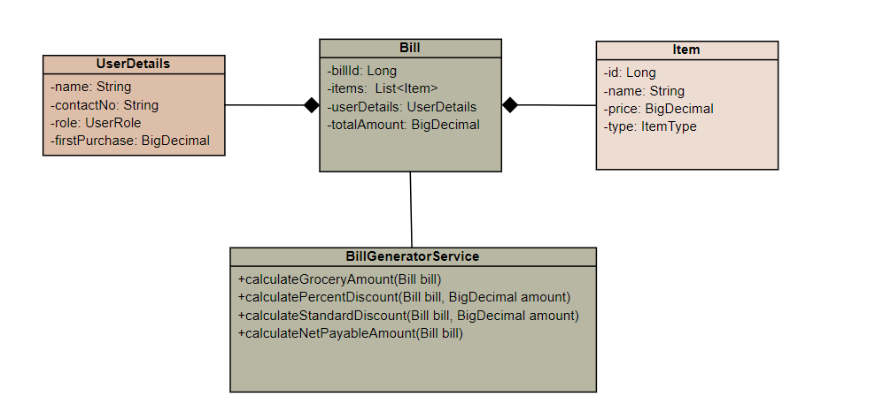
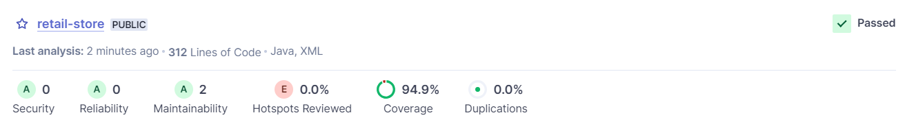
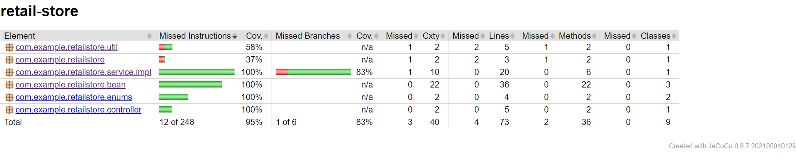

# Retail Store Billing System

## Overview

The Retail Store Billing System is a Java-based application that calculates the net payable amount for a given bill. The application considers various user roles and provides discounts based on the type of items and user roles.

## Technologies Used

- Java 17
- Spring Boot 3+
- JUnit
- Mockito
- Jacoco
- SonarQube

## UML Diagrams

### Class Diagram

### Bean Classes

##### 1. `Item`

The `Item` class represents an item in the retail store. It contains details such as `id`, `name`, `type` (enumeration), and `price`.

##### 2. `UserDetails`
The `UserDetails` class represents details about a user, including `name`, `contactNo`, `role` (enumeration), and `firstPurchase` date.

##### 3. `Bill`
The `Bill` class represents a bill generated for a user's purchase, including `billId`, `items`, `userDetails`, and `totalAmount`.

### Service Implementation
- The BillGeneratorServiceImpl class is a service responsible for calculating various aspects of a retail bill. 

- It implements the IBillGeneratorService interface, defining methods for calculating the total amount, discounts, and net payable amount for a given bill.

####`Methods`
1. `calculateGroceryAmount(Bill bill)`

   This method calculates the total amount of grocery items in the given bill.

2. `calulatePercentDiscount(Bill bill, BigDecimal amount)`
   
   This method calculates the percent discount based on the user's role and the total amount of non-grocery items.

3. `calulateStandardDiscount(Bill bill, BigDecimal amount)`

   This method calculates the standard discount on the bill after applying the percent discount.

4. `calulateNetPayableAmount(Bill bill)`

   This method calculates the net payable amount after applying both percent and standard discounts.
   
### Controller Implementation
- The BillGeneratorController class is a Spring MVC REST controller responsible for handling requests related to retail bill generation.

#### `Endpoints`
- Method: POST
- Path: /api/retail-store/calculateNetPayable
- Description: Calculates the net payable amount for a retail bill.
- Request Body: Validated Bill object.
- Response: Returns the calculated net payable amount as a BigDecimal.
- JSON Structure :

	{
		"billId": 123,               
		"items": [{
					"id": 1,
					"name": "Product A",
					"type": "GROCERY",
					"price": 20.50
				 }],
		"userDetails": {
    					"name": "John Doe",
    					"contactNo": "123-456-7890",
    					"role": "CUSTOMER",
    					"firstPurchase": "2022-01-01"
    					},
    	"totalAmount": 221.39
	}
	
## Assumptions

1. **Affiliated Customer:** An affiliated customer is assumed to be someone who has enrolled in the loyalty point system of the retail store.

2. **Regular Customer:** A regular customer is considered to be an individual who has registered with the retail store using their contact number, and their first purchase is identified based on this registration.

3. **Discount Calculation:** The calculation of discounts follows the assumption that percentage-based discounts are applied first, considering the nature of items (grocery or non-grocery). Standard discounts are then applied after deducting the percentage-based discounts from the total bill amount.

These assumptions are made for illustrative purposes and may vary based on the actual business rules and requirements of your retail store application.

## Getting Started

Follow these steps to run the Retail Store Billing System on your local machine:

#### `Prerequisites`

- Java Development Kit (JDK) installed
- Integrated Development Environment (IDE) such as IntelliJ or Eclipse or Spring Tool Suite
- Maven for building the project
- SonarQube for running the sonar server

#### `Steps`

1. Clone the repository to your local machine:

	git clone https://github.com/your-username/retail-store.git
   
2. Open the project in your preferred IDE.

3. Build the project using Maven:

	mvn clean install
   
4. Run the application:

	java -jar target/retail-store-0.0.1-SNAPSHOT.jar

5. The application will start, and you can access it at http://localhost:8080.

### Swagger Documentation

Explore the API documentation using Swagger UI:

- [Swagger UI](http://localhost:8080/swagger-ui/index.html#/)

Make sure your application is running, and you can access the Swagger UI link locally.

### SonarQube Analysis

####`Prerequisites`
- Download and install SonarQube.

####`Steps`

1. Start the SonarQube Server (Make sure it is up and running)

2. Add the SonarQube Maven Plugin to your pom.xml along with the credentials to access the server.

3. Run the SonarQube analysis:

	mvn sonar:sonar

Check the SonarQube dashboard for code quality metrics at http://localhost:9000

### Code Coverage Report
 This project utilizes Jacoco for code coverage.
 
####`Steps`
- Execute the following Maven command:

	mvn clean test
	 
Locate the generated Jacoco report at target/site/jacoco/index.html.

